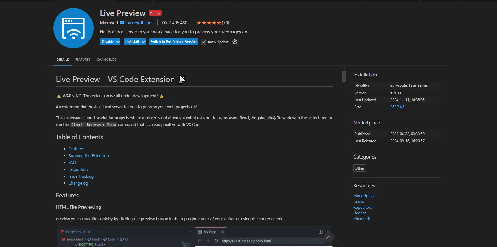
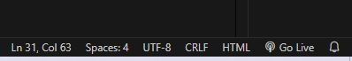
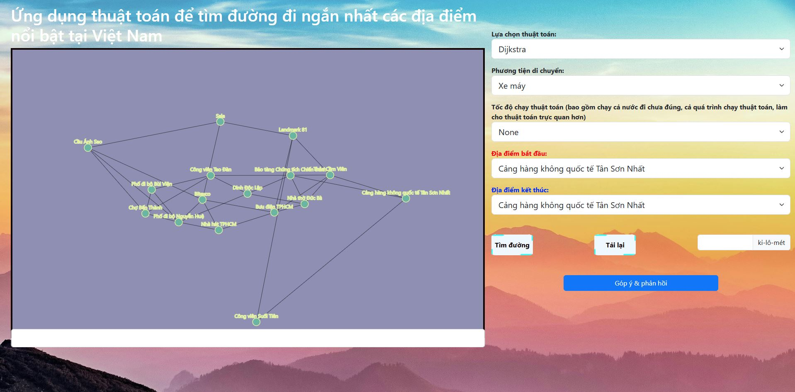
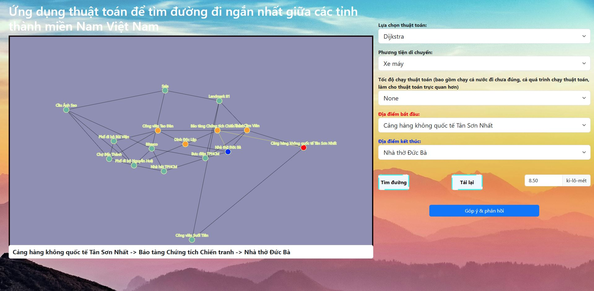

# Đề Tài: Ứng Dụng Thuật Toán Tìm Đường Đi Ngắn Nhất Giữa Các Địa Điểm Nổi Bật Ở Thành phố Hồ Chí Minh
---

### Mô Tả Đề Tài
Ứng dụng được xây dựng nhằm hỗ trợ người dùng tìm kiếm đường đi ngắn nhất giữa các địa điểm nổi bật tại Việt Nam, dựa trên thuật toán đồ thị như **Dijkstra**, **Bellman-Ford**, và **A***. Giao diện đồ họa thân thiện giúp người dùng dễ dàng thao tác, kết hợp với các chức năng trực quan hóa quá trình tính toán và chọn lựa phương tiện di chuyển phù hợp.

### Các Thành Phần Chính
1. **Đồ thị địa điểm**: Các địa điểm nổi bật được biểu diễn dưới dạng đồ thị, trong đó:
   - Các đỉnh (nodes) là địa điểm.
   - Các cạnh (edges) là đường đi giữa các địa điểm kèm khoảng cách.
2. **Thuật toán**:
   - **Dijkstra**: Tìm đường đi ngắn nhất từ một điểm đến tất cả các điểm còn lại.
   - **Bellman-Ford**: Xử lý đồ thị có trọng số âm, đảm bảo kết quả chính xác.
   - **A***: Sử dụng hàm heuristic để cải thiện hiệu năng tìm kiếm.
3. **Phương tiện di chuyển**:
   - Người dùng có thể chọn giữa "Xe máy" và "Xe ô tô", với mỗi phương tiện áp dụng các hạn chế khác nhau lên đồ thị (ví dụ: một số đường chỉ dành cho ô tô).

### Ý Nghĩa Ứng Dụng
- Hỗ trợ lập kế hoạch di chuyển tối ưu giữa các địa điểm du lịch.
- Tăng cường hiểu biết về các thuật toán đồ thị thông qua trực quan hóa.
- Đề xuất tuyến đường tối ưu cho các loại phương tiện khác nhau.

---
# Hướng dẫn cài đặt chương trình
## 1. Yêu Cầu Hệ Thống

### Phần mềm cần thiết
- **Trình duyệt web**: Google Chrome, Mozilla Firefox, Microsoft Edge,...
- **Web server** (khuyến nghị nếu cần tải file `graph.json` qua HTTP):
  - [Node.js](https://nodejs.org/) hoặc [Python](https://www.python.org/).
  - Hoặc sử dụng extension **Live Server** trong Visual Studio Code.
- **Visual Studio Code**: phiên bản mới nhất

### Thư viện được sử dụng
- **D3.js** (v7) - Visualize đồ thị.
- **Bootstrap** - Thiết kế giao diện.
- **EmailJS** - Gửi phản hồi qua email.

---

## 2. Hướng Dẫn Cài Đặt

### Cài Đặt Web Server (Tùy Chọn)

#### a. **Dùng Node.js**
1. Cài đặt Node.js từ [trang chủ Node.js](https://nodejs.org/).
2. Mở terminal, chuyển đến thư mục chứa project.
3. Chạy lệnh sau để khởi động server đơn giản:
   ```bash
   npx serve
   ```
4. Mở trình duyệt và truy cập `http://localhost:3000`.

#### b. **Dùng Python**
1. Đảm bảo Python đã được cài đặt.
2. Mở terminal, chuyển đến thư mục chứa project.
3. Chạy lệnh sau để khởi động server:
   ```bash
   python -m http.server
   ```
4. Mở trình duyệt và truy cập `http://localhost:8000`.

#### c. **Dùng Live Server** (nếu dùng Visual Studio Code)
1. Cài đặt Visual Studio Code từ [trang chủ VS Code](https://code.visualstudio.com/).
2. Cài extension **Live Preview** từ marketplace.
   
3. Mở file `index.html` và nhấn **Go Live**.
   

---

## 3. Cách Sử Dụng

### Chạy Ứng Dụng
1. Mở trình duyệt và truy cập vào file `index.html` (nếu không dùng web server, chỉ cần mở file).
2. Giao diện sẽ hiển thị đồ thị các địa điểm.

### Các Chức Năng Chính
#### a. **Tìm đường đi ngắn nhất**
1. Chọn **thuật toán** trong mục "Lựa chọn thuật toán":
   - Dijkstra
   - Bellman-Ford
   - A*
2. Chọn **phương tiện di chuyển**: Xe máy hoặc Xe ô tô.
3. Chọn địa điểm **bắt đầu** và **kết thúc** từ các danh sách thả xuống.
4. Nhấn **Tìm đường** để hiển thị kết quả.
5. Kết quả bao gồm:
   - Đường đi tối ưu hiển thị trên đồ thị.
   - Khoảng cách (tính bằng km).

#### b. **Phản hồi và góp ý**
1. Nhấp vào nút "Góp ý & phản hồi" ở cuối giao diện.
2. Điền thông tin vào form phản hồi.
3. Nhấn "Gửi" để gửi ý kiến qua EmailJS.

---

## 4. Cấu Trúc File
- `index.html`: Trang chính của ứng dụng.
- `feedback.html`: Trang phản hồi.
- `graph.json`: Dữ liệu đồ thị các địa điểm và khoảng cách.
- `style.css`: Định dạng giao diện (nếu có).
- Các thư viện được tích hợp qua CDN:
  - Bootstrap
  - D3.js
  - EmailJS.

---

## 6. Demo chương trình:
### Giao diện chính

### Đường đi ngắn nhất 

### web demo: https://tda234574534243.github.io/GraphFullLTDT/

---

## 7. Lưu Ý
- Nếu không tải được dữ liệu từ `graph.json`, hãy kiểm tra lại tất cả các file cần thiết cho chương trình (không mở trực tiếp file `index.html`).
- Cần cấu hình dịch vụ **EmailJS** với API key cá nhân nếu muốn sử dụng chức năng gửi phản hồi.

---

## 8. Teammate
- Manwithgame [https://github.com/tda234574534243]
- TruongAnhKietK49 [https://github.com/TruongAnhKietK49]
- Ynhi49cnttc [https://github.com/Ynhi49cnttc]
- ThanhTien [stillupdating]

